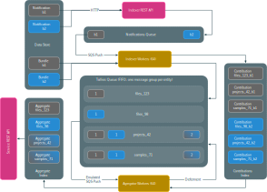

[](https://travis-ci.org/DataBiosphere/azul)
[](https://coveralls.io/github/DataBiosphere/azul?branch=develop)
[](https://codecov.io/gh/DataBiosphere/azul)

The Azul project contains the components that together serve as the backend to
Boardwalk, a web application for browsing genomic data sets.

[TOC levels=1-4]: # "# Table of Contents"

# Table of Contents
- [1. Architecture Overview](#1-architecture-overview)
    - [1.1 Components](#11-components)
    - [1.2 Architecture Diagram](#12-architecture-diagram)
- [2. Getting Started](#2-getting-started)
    - [2.1 Development Prerequisites](#21-development-prerequisites)
    - [2.2 Runtime Prerequisites (Infrastructure)](#22-runtime-prerequisites-infrastructure)
    - [2.3 Project configuration](#23-project-configuration)
        - [2.3.1 AWS credentials](#231-aws-credentials)
        - [2.3.2 Google credentials](#232-google-credentials)
        - [2.3.3 For personal deployment (AWS credentials available)](#233-for-personal-deployment-aws-credentials-available)
    - [2.4 PyCharm](#24-pycharm)
- [3. Deployment](#3-deployment)
    - [3.1 One-time provisioning of shared cloud resources](#31-one-time-provisioning-of-shared-cloud-resources)
    - [3.2 Provisioning cloud infrastructure](#32-provisioning-cloud-infrastructure)
    - [3.3 Deploying lambda functions](#33-deploying-lambda-functions)
    - [3.4 Provisioning stable API domain names](#34-provisioning-stable-api-domain-names)
    - [3.5 Subscribing to DSS](#35-subscribing-to-dss)
    - [3.6 Reindexing](#36-reindexing)
    - [3.7 Cancelling an ongoing (re)indexing operation](#37-cancelling-an-ongoing-reindexing-operation)
    - [3.8 Deleting all indices](#38-deleting-all-indices)
    - [3.9 Deleting a deployment](#39-deleting-a-deployment)
- [4. Running indexer or service locally](#4-running-indexer-or-service-locally)
- [5. Troubleshooting](#5-troubleshooting)
- [6. Branch flow & development process](#6-branch-flow--development-process)
    - [6.1 Deployment branches](#61-deployment-branches)
- [7. Operational Procedures](#7-operational-procedures)
    - [7.1 Main deployments and promotions](#71-main-deployments-and-promotions)
        - [7.1.1 Initial setup](#711-initial-setup)
        - [7.1.2 Prepare for promotion](#712-prepare-for-promotion)
        - [7.1.3 Finishing up deployment / promotion](#713-finishing-up-deployment--promotion)
    - [7.2 Big red button](#72-big-red-button)
    - [7.3 Copying bundles](#73-copying-bundles)
- [8. Scale testing](#8-scale-testing)
- [9. Continuous deployment and integration](#9-continuous-deployment-and-integration)
    - [9.1 The Sandbox Deployment](#91-the-sandbox-deployment)
    - [9.2 Security](#92-security)
    - [9.3 Networking](#93-networking)
    - [9.4 Storage](#94-storage)
    - [9.5 Gitlab](#95-gitlab)
    - [9.6 Registering the Gitlab Runner](#96-registering-the-gitlab-runner)
    - [9.7 Updating Gitlab](#97-updating-gitlab)
    - [9.8 The Gitlab Build Environment](#98-the-gitlab-build-environment)
    - [9.8 Cleaning up hung test containers](#99-cleaning-up-hung-test-containers)
- [10. Kibana](#10-kibana)
- [11. Making wheels](#11-making-wheels)
- [12. Development tools](#12-development-tools)
    - [12.1 OpenAPI Development](#121-openapi-development)

# 1. Architecture Overview

## 1.1 Components

[Data Store]: https://github.com/HumanCellAtlas/data-store

Azul consists of two components: an indexer and a web service. The Azul indexer
is an AWS Lambda function that responds to web-hook notifications about bundle
addition and deletion events occurring in a [Data Store] instance. The indexer
responds to those notifications by retrieving the bundle's metadata from said
data store, transforming it and writing the transformed metadata into an
Elasticsearch index. The transformation extracts selected entities and
denormalizes the relations between them into a document shape that facilitates
efficient queries on a number of customizable metadata facets.

The Azul web service, another AWS Lambda function fronted by API Gateway, serves
as a thin translation layer between Elasticsearch and the Boardwalk UI,
providing features like pluggable authentication, field name translation and
introspective capabilities such as facet and entity type discovery.

Both the indexer and the web service allow for project-specific customizations
via a plug-in mechanism, allowing the Boardwalk UI codebase to be functionally
generic with minimal need for project-specific behavior.

## 1.2 Architecture Diagram



# 2. Getting Started

## 2.1 Development Prerequisites

- Python 3.6 (3.7 does not work) with `pip`.

- The `bash` shell

- [Docker] for running the tests (the community edition is sufficient).
  The minimal required version is uncertain, but 19.03, 18.09, and 17.09 are 
  known to work.

- Terraform (optional, to create new deployments). Refer the official
  documentation on how to [install terraform]. On macOS with Homebrew installed,
  'brew install terraform' works, too.

- AWS credentials configured in `~/.aws/credentials` and/or `~/.aws/config`

- [git-secrets] must be installed

[install terraform]: https://www.terraform.io/intro/getting-started/install.html
[git-secrets]: https://github.com/awslabs/git-secrets
[Docker]: https://docs.docker.com/install/overview/

## 2.2 Runtime Prerequisites (Infrastructure)

An instance of the HCA [Data Store] aka DSS. The URL of that instance can be
configured in `environment` or `deployments/*/environment`.

The remaining infrastructure is managed internally using TerraForm.

## 2.3 Project configuration

Getting started without attempting to make contributions does not require AWS
credentials. A subset of the test suite passes without configured AWS
credentials. To validate your setup, we'll be running one of those tests at the
end.

1. Create a Python 3.6 virtual environment and activate it:

   ```
   cd azul
   python3.6 -m venv .venv
   source .venv/bin/activate
   ```

2. Install the development prerequisites:

   ```
   pip install -U pip==10.0.1 setuptools==40.1.0 wheel==0.32.3
   pip install -Ur requirements.dev.txt
   ```

   Newer versions of pip are incompatible with some of our requirements, hence
   the pin on the 10.0.1 version.
   
   Ubuntu users using their system's default Python installation must install
   `python3-dev` before the requirements can be built.
   
   ```
   sudo apt install python3-dev
   ```

3. Activate the `dev` deployment:

   ```
   cd deployments
   ln -snf dev .active
   cd ..
   ```

4. Load the environment:

   ```
   source environment
   ```

   Examine the output.

5. If you have push access to the remote, you'll need to install [git-secrets],
   enable the commit hooks for it and configure patterns for AWS and Google:

   ```
   git secrets --install
   git secrets --register-aws
   git secrets --add '[-]----BEGIN.PRIVATE.KEY-----'
   ```

   The `[-]` at the beginning is to bypass the command line parser from
   interpreting the pattern as an option. The use of period instead of space
   works around a bug in `git secrets` which treats a pattern with a space as
   two independent patterns.

   macOS users who installed git-secrets via Homebrew may get

   ```
   git: 'secrets' is not a git command. See 'git --help'.
   ```

   when they try to commit with Atlassian Sourcetree. If that's the case,
   configure Sourcetree (Preferences – Git) to use the *System Git* at
   `/usr/local/bin/git`. Then run

   ```
   sudo launchctl config user path /usr/local/bin:/usr/bin:/bin:/usr/sbin:/sbin
   ```

   and reboot.

6. Run `make`. It should say `Looking good!` If one of the sanity checks fails,
   address the complaint and repeat. The various sanity checks are defined in
   `common.mk`.
   
   Some checks utilize `git`. If the repository was cloned using HTTP, you may
   be asked to authenticate. Using SSH is recommended, but for the purposes of
   this check the credentials may be left blank.

7. Make sure Docker is running without root access. Run the following command 
   *without `sudo`*:
   
   ```
   docker ps
   ```

8. Confirm proper configuration. Run the following:

   ```
   make test
   ```

### 2.3.1 AWS credentials

```
TBD
```

### 2.3.2 Google credentials

1. Ask to be invited to the Google Cloud project `human-cell-atlas-travis-test`

2. Log into `console.cloud.google.com`, select the `human-cell-atlas-travis-test` project

3. Navigate to `IAM & admin`, locate your account in list, take note of the email address found
   in the `Member` column (eg. alice@example.com)

   ```
   Google Cloud Platform -> Navigation menu -> IAM & admin
   ```

4. Create a service account for project `human-cell-atlas-travis-test`

    ```
    IAM & admin -> Service Accounts -> [Create Service Account]
    ```
    
    * Step 1:
        1. Service Account Name: (use username part of email address noted in step 3 eg. alice)
        2. Service Account ID: (use auto-generated value eg. alice-42@human-cell-atlas-travis-test.iam.gserviceaccount.com)
        3. Create
        
    * Step 2:
        1. Role: Project -> Owner
        2. Continue
        
    * Step 3:
        1. Create Key -> JSON -> Create -> (Download file) -> Done

5. Move the downloaded JSON file to a location that you can reference in a config file

    ```
    $ mkdir /Users/alice/.gcp
    $ mv /Users/alice/Downloads/human-cell-atlas-travis-test-180b575fe2e6.json /Users/alice/.gcp/
    ```
    
6. Edit your deployment's `environment.local` file, uncomment and modify the `GOOGLE_…` variables

    ```
    $ vim /Users/alice/azul/deployments/alice.local/environment.local
    
    export GOOGLE_APPLICATION_CREDENTIALS="/Users/alice/.gcp/human-cell-atlas-travis-test-180b575fe2e6.json"
    export GOOGLE_PROJECT="human-cell-atlas-travis-test"
    ```

7. Repeat the previous step for other deployments as needed or alternatively create a symlink to your
   deployment's `environment.local` file

    ```
    $ cd /Users/alice/azul/deployments/samples/
    $ vim environment.local
      (or)
    $ ln -snf ../alice.local/environment.local environment.local 
    ```
    
### 2.3.3 For personal deployment (AWS credentials available)

Creating a personal deployment of Azul allows you test changes on a live system
in complete isolation from other users. If you intend to make contributions,
this is preferred. You will need IAM user credentials to the AWS account you are
deploying to.


1. Choose a name for your personal deployment. The name should be a short handle
   that is unique within the AWS account you are deploying to. It should also be
   informative enough to let others know whose deployment this is. We'll be
   using `foo` as an example here. The handle must only consist of alphabetic
   characters.

2. Create a new directory for the configuration of your personal deployment:

   ```
   cd deployments
   cp -r .example.local yourname.local
   ln -snf yourname.local .active
   cd ..
   ```

3. Edit `deployments/.active/environment` and
   `deployments/.active/environment.local` according to the comments in there.


## 2.4 PyCharm

Running tests from PyCharm requires `environment` to be sourced. The easiest way
to do this is to install `envhook.py`, a helper script that injects the
environment variables from `environment` into the Python interpreter process
started from the project's virtual environment in `.venv`:

```
python scripts/envhook.py install
```

The script works by adding a `sitecustomize.py` file to your virtual 
environment. If a different `sitecustomize` module is already present in your 
Python path, its `sitecustomize.py` file must be renamed or removed before the 
installation can proceed. The current install location can be found by importing
`sitecustomize` and inspecting the module's `__file__` attribute.

Whether you installed `envook.py` or not, a couple more steps are necessary to
configure PyCharm for Azul:

1. Under *Settings* -> *Project—Interpreter* select the virtual environment
   created above.

2. Set the `src` and `test` folders as source roots by right-clicking each 
   folder name and selecting *Mark Directory as* → *Sources Root*.
   
3. Exclude the `.venv`, `lambdas/indexer/vendor`, and  `lambdas/service/vendor` 
   folders by right-clicking each folder name and selecting *Mark Directory as*
   → *Excluded*.

Newer versions of PyCharm install another `sitecustomize` module which attempts 
to wrap the user-provided one, in our case `envhook.py`. This usually works 
unless `envhook.py` tries to report an error. PyCharm's `sitecustomize` swallows 
the exception and, due to a bug, raises different one. The original exception 
is lost, making diagnosing the problem harder. Luckily, the `sitecustomize` 
module is part of a rarely used feature that can be disabled by unchecking 
*Show plots in tool window* under *Settings* — *Tools* — *Python Scientific*. 

# 3. Deployment

## 3.1 One-time provisioning of shared cloud resources

Most of the cloud resources used by a particular deployment (personal or shared) 
are provisioned automatically by `make terraform` and `make deploy`. A handful 
of  resources must be created manually before invoking thise Makefile targets 
for the first time in a particular AWS account. This only needs to be done once 
per AWS account, before the first Azul deployment in that account. Additional 
deployments do not require this step.

Create an S3 bucket for shared Terraform and Chalice state. That bucket should 
have object versioning enabled and must not be publicly accessible since 
Terraform state may include secrets. If your developers assume a role via 
Amazon STS, the bucket should reside in the same region as the Azul deployment. 
This is because temporary STS AssumeRole credentials are specific to a region 
and won't be recognized by an S3 region that's different from the one the 
temporary credentials were issued in. To account for the region specificity of 
the bucket, you may want to include the region name at then end of the bucket 
name. That way you can have consistent bucket names across regions.

Create a Route 53 hosted zone for the Azul service and indexer. Multiple 
deployments  can share a hosted zone but they don't have to. The name of the 
hosted zone is configured with `AZUL_DOMAIN_NAME`. `make terraform` will 
automatically provision record sets in  the configured zone but it will not 
create the zone itself or register the  domain name it is associated with.
 
Optionally create another hosted zone for the URL shortener. The URLs produced 
by the Azul service's URL shortening endpoint will refer to this zone. The name 
of this zone is configured in `AZUL_URL_REDIRECT_BASE_DOMAIN_NAME`. It should be 
supported to use the same zone for both `AZUL_URL_REDIRECT_BASE_DOMAIN_NAME` and 
`AZUL_DOMAIN_NAME` but this was not tested. The shortener zone can be a 
subdomain of the main Azul zone but it doesn't have  to be.

If you intend to set up a Gitlab instance for CI/CD of your Azul deployments, an 
EBS volume needs to be created as well. See [gitlab.tf.json.template.py] and the 
[section on CI/CD](#9-continuous-deployment-and-integration) and for details. 


## 3.2 Provisioning cloud infrastructure

Once you've configured the project and your personal deployment or a shared 
deployment deployment you intend to create, and once you manually provisioned 
the shared cloud resources, it is time to provision the cloud infrastructure 
for your deployment. Running

```
make terraform
```

will display a plan and ask you to confirm it. Please consult the Terraform
documentation for details. You will need to run `make terraform` once to set up
your deployment and every time code changes define new cloud resources. The
resources are defined in `….tf.json` files which in turn are generated from
`….tf.json.template.py` files which are simple Python scripts containing the
desired JSON as Python dictionary and list literals and comprehensions.

## 3.3 Deploying lambda functions

Once the cloud infrastructure for your deployment has been provisioned, you can
deploy the project code into AWS Lambda. Running

```
make deploy
```

Will create or update AWS Lambda functions for each lambda defined in the
`lambdas` directory. It will also create or update an AWS API Gateway to proxy
the functions that act as web services. We call those functions *API lambdas*.

## 3.4 Provisioning stable API domain names

The HTTP endpoint offered by API Gateway have somewhat cryptic and hard to
remember domain names:

https://klm8yi31z7.execute-api.us-east-1.amazonaws.com/hannes/

Furthermore, the API ID at the beginning of the above URL is likely to change
when you accidentally delete the REST API and then recreate it. To provide
stable and user-friendly URLs for the API lambdas, we provision a *custom domain
name* object in API Gateway along with an ACM certificate and a CNAME record in
Route 53. Running `make terraform` again after `make deploy` will detect the
newly deployed API lambdas and create those resources for you. What the
user-friendly domain names look like depends on project configuration. The
default for HCA is currently

http://indexer.${AZUL_DEPLOYMENT_STAGE}.singlecell.gi.ucsc.edu/
http://service.${AZUL_DEPLOYMENT_STAGE}.singlecell.gi.ucsc.edu/

Personal deployments are subdomains of the domain for the ``dev`` deployment:

http://indexer.${AZUL_DEPLOYMENT_STAGE}.dev.singlecell.gi.ucsc.edu/
http://service.${AZUL_DEPLOYMENT_STAGE}.dev.singlecell.gi.ucsc.edu/

Note that while the native API Gateway URL refers to the stage in the URL path,
the stable URL mentions it in the domain name.

## 3.5 Subscribing to DSS

Once the Lambda functions have been deployed, and the custom domain names
provisioned, the indexer can be registered to receive notifications about new
bundles from the configured DSS instance.

```
make subscribe
```

By default, the creation of that subscription is enabled (see
`AZUL_SUBSCRIBE_TO_DSS` in `environment`). All shared deployments in
`deployments/` inherit that default.

Personal deployments should not be permanently subscribed to any DSS instance
because they are more likely to be broken, causing unnecessary load on the DSS
instance when it retries sending notifications to a broken personal Azul
deployment. To temporarily subscribe a personal deployment, set
`AZUL_SUBSCRIBE_TO_DSS` to 1 and run `make subscribe`. When you are done, run
`make unsubscribe` and set `AZUL_SUBSCRIBE_TO_DSS` back to 0.

Subscription requires credentials to a service account that has the
required privileges to create another service account under which the
subscription is then made. This indirection exists to facilitate shared
deployments without having to share any one person's Google credentials. The
indexer service account must belong to a GCP project that is whitelisted in the
DSS instance to which the indexer is subscribed to. The credentials of the
indexer service account are stored in Amazon Secrets Manager.

## 3.6 Reindexing

The DSS instance used by a deployment is likely to contain existing bundles. To
index them run:

```
make reindex
```

When reindexing, artificial notifications are generated by Azul. To distinguish
from legitimate notifications made by the DSS, the `subscription_id` field is
hardcoded to be `cafebabe-feed-4bad-dead-beaf8badf00d`.

## 3.7 Cancelling an ongoing (re)indexing operation

```
python scripts/manage_queues.py purge_all
```

## 3.8 Deleting all indices

```
make delete
```

## 3.9 Deleting a deployment


1. `cd` to the project root, then
   
   ```
   source environment
   ```

2. Select the deployment to deleted
   
   ```
   _select foo.local
   ```

3. Delete all Elasticseach indices in the selected deployment
   
   ```
   python scripts/reindex.py --delete
   ```

4. Unsubscribe
   
   ```
   make unsubscribe
   ```

5. Delete the API Gateway base path mappings 

   ```
   cd terraform
   make init
   terraform destroy $(terraform state list | grep aws_api_gateway_base_path_mapping | sed 's/^/-target /')
   cd ..
   ```

6. Delete lambdas

   ```
   make -C lambdas delete
   ```
   
   If `An error occurred (TooManyRequestsException) when calling the DeleteRestApi` error is encountered,
   retry this step. 

7. Destroy cloud infrastructure

   ```
   make -C terraform destroy
   ```
   
   The destruction of `aws_acm_certificate` resources may time out. Simply 
   repeat this step until it succeeds.

8. From the config bucket (see environment var AZUL_VERSIONED_BUCKET), 
   delete all keys relating to your deployment. 
   
9. Delete the local Terraform state file at 
   `deployments/.active/.terraform.{$AWS_PROFILE}/terraform.tfstate`.


# 4. Running indexer or service locally

1. As usual, activate the virtual environment and `source environment` if you
   haven't done so already

2. `cd lambdas/service`

3. Run

   ```
   make local
   ```

4. You can now hit the app under `http://127.0.0.1:8000/`

PyCharm recently added a feature that allows you to attach a debugger: From the
main menu choose *Run*, *Attach to local process* and select the `chalice`
process.

# 5. Troubleshooting

`make terraform` complains

```
Initializing the backend...
Backend configuration changed!

Terraform has detected that the configuration specified for the backend
has changed. Terraform will now check for existing state in the backends.


Error inspecting states in the "s3" backend:
    NoSuchBucket: The specified bucket does not exist
```

… but the bucket does exist. Make sure
`deployments/.active/.terraform/terraform.tfstate` refers to the correct bucket,
the one configured in `AZUL_VERSIONED_BUCKET`. If it doesn't, you may
have to remove that file or modify it to fix the bucket name.
##
If you get the following exception in the indexer lambda:
```
An error occurred (AccessDeniedException) when calling the GetParameter operation: User: arn:aws:sts::{account_id}:assumed-role/azul-indexer-{deployment_stage}/azul-indexer-{deployment_stage}-index is not authorized to perform: ssm:GetParameter on resource: arn:aws:ssm:{aws_region}:{account_id}:parameter/dcp/dss/{deployment_stage}/environment: ClientError
Traceback (most recent call last):  
    ...
botocore.exceptions.ClientError: An error occurred (AccessDeniedException) when calling the GetParameter operation: User: arn:aws:sts::{account_id}:assumed-role/azul-indexer-{deployment_stage}/azul-indexer-{deployment_stage}-index is not authorized to perform: ssm:GetParameter on resource: arn:aws:ssm:{aws_region}:{account_id}:parameter/dcp/dss/integration/environment
```

Check whether the DSS switched buckets. If so, the lambda policy may need to be 
updated to reflect that change. To fix this, redeploy the lambdas (`make 
deploy`) in the affected deployment.

# 6. Branch flow & development process

**This section should be considered a draft. It describes a future extension to the current branching flow.**

The section below describes the flow we want to get to eventually, not the one
we are currently using while this repository recovers from the aftermath of its
inception.

The declared goal here is a process that prevents diverging forks yet allows
each project to operate independently as far as release schedule, deployment
cadence, project management and issue tracking is concerned. The main challenges
are 1) preventing contention on a single `develop` or `master` branch, 2)
isolating project-specific changes from generic ones, 3) maintaining a
reasonably linear and clean history and 4) ensuring code reuse.

The [original repository](https://github.com/DataBiosphere/azul), also known as
*upstream*, should only contain generic functionality and infrastructure code.
Project-specific functionality should be maintained in separate project-specific
forks of that repository. The upstream repository will only contain a `master`
branch and the occasional PR branch.

Azul dynamically imports project-specific plugin modules from a special location
in the Python package hierarchy: `azul.projects`. The package structure in
upstream is

```
root
├── ...
├── src
│   └── azul
│       ├── index
│       │   └── ...
│       ├── projects (empty)
│       ├── service
│       │   └── ...
│       └── util
│       │   └── ...
└── ...
```

Note that the `projects` directory is empty.

The directory structure in forked repositories is generally the same with one
important difference. While a fork's `master` branch is an approximate mirror of
upstream's `master` and therefore also lacks content in `projects`, that
directory *does* contain modules in the fork's `develop` branch. In
`HumanCellAtlas/azul-hca`, the fork of Azul for the HumanCellAtlas project, the
`develop` branch would look like this:


```
root
├── ...
├── src
│   └── azul
│       ├── index
│       │   └── ...
│       ├── projects
│       │   └── hca
│       │       └── ...
│       ├── service
│       │   └── ...
│       └── util
│       │   └── ...
└── ...
```

The `develop` branch would only contain changes to the `azul.projects.hca`
package. All other changes would have to be considered generic—they would occur
on the fork's `master` branch and eventually be merged into upstream's `master`
branch. The `master` branches in each fork should not be divergent for sustained
periods of time while the project-specific branches can and will be.

The reason why each fork maintains a copy of the `master` branch is that forks
generally need to have a place to test and evaluate generic features before they
are promoted upstream. If there wasn't a `master` branch in a fork, the
project-specific `develop` branch in that fork would inevitably conflate
project-specific changes with generic ones. It would be very hard to selectively
promote generic changes upstream, even if the generic changes were separate
commits.

The flow presented here establishes an easy-to-follow rule: If you're modifying
`azul.projects.hca`, you need to do so in a PR against `develop`. If you're
modifying anything else, you need to do so in a PR against `master`. The figure
below illustrates that.

```
                                                      ●────● feature/generic-foo
                                                     ╱
                                              4     ╱
    ─────●────────────────────────────────────●────●──────────────        master
          ╲                                  ╱
 azul      ╲                                ╱
 ─ ─ ─ ─ ─ ─╲─ ─ ─ ─ ─ ─ ─ ─ ─ ─ ─ ─ ─ ─ ─ ╱ ─ ─ ─ ─ ─ ─ ─ ─ ─ ─ ─ ─ ─ ─ ─ ─ ─ ─
 azul-hca    ╲                            ╱
              ╲                          ╱
    ──────●────●────●────●────●────●────●──────────────────────────       master
           ╲   1     ╲    ╲   A'   B'
            ╲         ╲    ╲
             ╲         ╲    ●────● feature/master/generic-stuff
              ╲         ╲   A    B
               ╲         ╲
                ●─────────●─────────────●────●────●─────────────────     develop
                2         3              ╲   C'   D'
                                          ╲
                                           ●────● feature/develop/specific-stuff
                                                C    D
```

Merge commit 1 from the upstream `master` branch integrates upstream changes
into the fork. These may be generic changes merged upstream from other forks or
changes that were directly PR-ed against `master` in upstream. Commit 2 marks
the beginning of the `develop` branch, adding the `azul.projects.hca` package.
Merge commit 3 brings the changes from commit 1 into the `develop` branch.

Another important rule is that collaborative branches like `develop` and
`master` are never rebased. Changes are exchanged between them using merge
commits instead. Individual branches however, like feature branches, are always
rebased onto the base branch. In the above example,
`feature/master/generic-stuff` is first rebased onto `master`, creating commits
A' and B'. Later those changes are merged upstream via commit 4. Both the rebase
and the merge happen via a pull request, but the landing action will be "Rebase
and merge" for the first PR and "Create a merge commit" for the second.

The reason for this distinction is that rebasing usually triggers more rebasing
of branches that were based on the rebased branch. It also rewrites the commit
timestamps, thereby obfuscating the history to some extent. For these two
reasons, rebasing is not a sustainable practice for collaborative branches. For
individual branches however, rebasing is possible because feature branches are
typically not used as a base for other branches. Rebasing is also desirable
because it produces a cleaner, linear history and we should use it whenever
possible. The back and forth merging between collaborative branches produces a
history that's somewhat convoluted so it is important to keep the history as
clean as possible in between merges.

Generic changes don't have to be conceived in a fork. We can also PR them
directly against the upstream repository as illustrated by branch
`feature/generic-foo`.

The most common type of pull request in a fork is one against that fork's
`develop` branch, `feature/develop/specific-stuff` for example. Note that
changes occurring on `develop` are never merged upstream.

As mentioned before, merge commit 4 is done via a pull request against the
upstream repository. It is possible and perfectly acceptable that such upstream
PRs combine multiple unrelated changes. They should be requested by the team
lead for the forking project and reviewed by an upstream lead. Shortly after the
PR lands, the requesting lead should perform a fast-forward merge of the
upstream `master` branch into the fork's `master` branch. This will propagate
the merge commit downstream before any subsequent commits occurring on fork's
`master` have a chance to complicate the history by introducing the infamous
merge of merge commits.

```
$ git branch
* master
  develop
$ git merge --ff-only upstream/master
Updating 450b0c0..212003c
Fast-forward
```

This procedure requires that the lead's local clone of the fork be set up with
two remotes: `origin` (the forked repository) and `upstream` (the upstream
repository). Other team members can usually get by with just one remote,
`origin`.

## 6.1 Deployment branches

The code in the upstream repository should never be deployed anywhere because it
does not contain any concrete modules to be loaded at runtime. The code in a
fork, however, is typically active in a number of deployments. The specifics
should be left to each project but the rule of thumb should be that each
deployment corresponds to a separate branch in the fork. The `azul-hca` fork has
four deployments: development, integration, staging and production. The
development deployment, or `dev`, is done from the `develop` branch. Whenever a
commit is pushed to that branch, a continuous deployment script deploys the code
to AWS. The other deployment branches are named accordingly. Changes are
promoted between deployments via a merge. The merge is likely going to be a
fast-forward. A push to any of the deployment branches will trigger a CI/CD
build that performs the deployment. The promotion could be automatic and/or
gated on a condition, like tests passing.

# 7. Operational Procedures

## 7.1 Main deployments and promotions

We will refer to the branch of the stage to which you are deploying as the
**`TARGET`** branch. The branch of the stage just below will be referred to as
the **`SOURCE`** branch.

This cheat sheet may differ from branch to branch. Be sure to follow the cheat
sheet in the README on the branch currently checked out.

### 7.1.1 Initial setup

[Gitlab instance]: https://gitlab.dev.singlecell.gi.ucsc.edu/

_Note: You can skip this step if you've deployed or promoted with Gitlab at
least once already._

[SSH keys]: https://gitlab.dev.singlecell.gi.ucsc.edu/profile/keys

1. For promotion, we recommend keeping a separate clone of Azul that is never in
   a dirty state. To create this if it doesn't yet exist run

   ```
   git clone git@github.com:DataBiosphere/azul.git azul.stable
   ```
   
   Then follow the setup instructions in [2.3 Project configuration](#23-project-configuration).

2. Next you will need to login to our [Gitlab instance] in order to be able to
   push to Gitlab which automatically takes care of most of the deployment
   process. If you haven't signed on yet, sign on with Github. You will need at
   least `developer` permissions in order to be able to `push` to Gitlab.
   Contact the team lead if you have problems signing on or have insufficient
   permissions.

3. Deposit you public SSH key into the [SSH keys] section of your profile so
   that you can push to Git repositories hosted on that Gitlab instance.

4. Now that your SSH key is set up, you will need to add Gitlab as a remote. Run

   ```
   git remote add gitlab.dev git@ssh.gitlab.dev.singlecell.gi.ucsc.edu:ucsc/azul.git
   ```

   Run

   ```
   git fetch gitlab.dev
   ```

   to ensure that your connection is working.

If you have been given write access to our production Gitlab instance, you need
to repeat these steps for that instance as well. For the name of the `git`
remote use `gitlab.prod` instead of `gitlab.dev` in step 4 above. The hostname
of that instance is the same as that of the Gitlab instance for the lesser
deployments, without `.dev`. 

Note that access to the production instance of Gitlab does not necessarily
imply access to production AWS account which that Gitlab instance deploys to.
So while you may be able to run certain `make` targets like `make reindex` or
`make terraform` against the development AWS account (with `dev`, `integration`
or `staging` selected), you may not be able to do the same for the production
AWS account (with `prod` selected).


### 7.1.2 Prepare for promotion

_NOTE: Skip these steps if you are deploying without promoting changes._

[DCP release SOP]: https://allspark.dev.data.humancellatlas.org/dcp-ops/docs/wikis/SOP:%20Releasing%20new%20Versions%20of%20DCP%20Software

_NOTE: If promoting to `staging` or `prod` you will need to do these steps **at least
24 hours in advance** so that the release notes are ready in time._

1. From the `azul.stable` clone make sure all of the relevant branches are up to
   date

   ```
   cd azul.stable
   git checkout SOURCE
   git pull
   git checkout TARGET
   git pull
   ```

2. You should be on the `TARGET` branch. Run

   ```
   git merge --no-ff SOURCE
   ```

   and resolve conflicts in necessary. Conflict resolution should only be
   necessary if cherry-picks occured on the target branch.

3. The merge may have affected `README.md`, the file you are looking at right
   now. Reopen the file now to ensure you are following the updated version.

4. Now you need to create the release notes. (Skip this step if no link to the release
   notes document can be found either in the #dcp-ops channel on HCA Slack or in
   the Google Drive folder mentioned in the [DCP release SOP].

   To produce the list of changes for the DCP release notes, first find the
   previous release tag for the TARGET branch. Then run:

   ```
   git log LAST_RELEASE_TAG..HEAD --format="%C(auto) %h %s" --graph
   ```
   Edit this output so that the commits within merged branches are removed, along with
   merge commits between deployments. For example
   ```
   *  C  <-- merge commit
   |\
   | *  B
   |/
   *  A
   *  Merge branch 'develop' into integration
   ```
   should be changed to look like
   ```
   *  C  <-- merge commit
   *  A
   ```

   For the version, use the full hash of the latest commit:

   ```
   git log -1 --format="%H"
   ```

5. At this point you should determine whether or not you will need to reindex.
   The `CHANGELOG.yml` _should_ contain this information but is notoriously
   unreliable. Try running

   ```
   git diff LAST_RELEASE_TAG..HEAD src/azul/project/ src/azul/indexer.py src/azul/plugin.py src/azul/transformer.py
   ```

   where `LAST_RELEASE_TAG` is the previous release of the target branch. If the diff
   contains non-trivial changes reindexing is probably necessary. When in doubt
   assume yes.

### 7.1.3 Finishing up deployment / promotion

If promoting to staging or production this part of the process must be
coordinated on the
[#dcp-ops](https://humancellatlas.slack.com/messages/G9XD6L0AD) Slack channel.
While any component can technically promote to integration at any time, you
should consider that promoting to integration while the DCP-wide test is red
for that deployment could interfere with other teams' efforts to fix the test.
If in doubt ask on #dcp-ops.

None of these steps can be performed ahead of time. Only perform them once you
are ready to actually deploy.

1. Activate your virtual environment and run
   ```
   source environment
   ```
   and then select the target deployment stage with
   ```
   _select STAGE
   ```
   where stage is one of `dev`, `integration`, `staging`, or `prod`

2. Now you need to push the current branch to Github. This is needed because
   the Gitlab build performs a status check update on Github. This would fail
   if Github didn't know the commit.

   ```
   git push origin
   ```

3. Finally, push to Gitlab.

   ```
   git push gitlab.dev   # for a dev, integration or staging deployment
   git push gitlab.prod  # for a prod deployment
   ```

   The build should start immediately. You can monitor its progress from the
   [Gitlab Pipelines page](https://gitlab.gitlab.dev.singlecell.gi.ucsc.edu/ucsc/azul/pipelines).
   
   If reindexing and promoting to staging or production, send a second 
   warning about reindexing to the #data-wrangling channel at this point.
   
   Wait until the pipeline on Gitlab succeeds or fails. If the build fails before 
   the `deploy` stage, no permanent changes were made to the deployment but you 
   need to investigate the failure. If the pipeline fails at or after the `deploy` 
   stage, you need triage the failure. If it can't be resolved manually, you need 
   to reset the branch back to the LAST_RELEASE_TAG and repeat step 2 in this section.

4. Invoke the health and version endpoints.

   * For the `develop` branch and the corresponding `dev` deployment use

     ```
     http https://indexer.dev.singlecell.gi.ucsc.edu/version
     http https://service.dev.singlecell.gi.ucsc.edu/version
     http https://indexer.dev.singlecell.gi.ucsc.edu/health
     http https://service.dev.singlecell.gi.ucsc.edu/health
     ```

   * For the `integration` branch/deployment use

     ```
     http https://indexer.integration.singlecell.gi.ucsc.edu/version
     http https://service.integration.singlecell.gi.ucsc.edu/version
     http https://indexer.integration.singlecell.gi.ucsc.edu/health
     http https://service.integration.singlecell.gi.ucsc.edu/health
     ```

   * For the `staging` branch/deployment use

     ```
     http https://indexer.staging.singlecell.gi.ucsc.edu/version
     http https://service.staging.singlecell.gi.ucsc.edu/version
     http https://indexer.staging.singlecell.gi.ucsc.edu/health
     http https://service.staging.singlecell.gi.ucsc.edu/health
     ```

   * For the `prod` branch/deployment use

     ```
     http https://indexer.singlecell.gi.ucsc.edu/version
     http https://service.singlecell.gi.ucsc.edu/version
     http https://indexer.singlecell.gi.ucsc.edu/health
     http https://service.singlecell.gi.ucsc.edu/health
     ```

5. Assuming everything is successful, run

   ```
   make tag
   ```

   and the

   ```
   git push ...
   ```

   invocation that it echoes.

6. In Zenhub, move all tickets from the pipeline representing the source
   deployment of the promotion to the pipeline representing the target
   deployment.

7. In the case that you need to reindex run the manual `reindex` job on the
   Gitlab pipeline representing the most recent build on the current branch.

## 7.2 Big red button

In the event of an emergency, Azul can be shut down immediately using the 
`enable_lambdas.py` script. Before using this script, make sure that the desired 
deployment is selected and your Python virtual environment is activated.

Shut down Azul by running

```
python scripts/enable_lambdas.py --disable
```
   
Once your issue has been resolved, you can resume Azul's services by running

```
python scripts/enable_lambdas.py --enable
```


## 7.3 Copying bundles

In order to copy bundles from one DSS instance to another, you can use
`scripts/copy_bundles.py`. The script copies specific bundles or all bundles
listed in a given manifest. It iterates over all source bundles, and all files
in each source bundle. It copies the files by determining the native URL
(`s3://…` ) of the DSS blob object for each file and passing that native URL to
the destination DSS' `PUT /files` endpoint as the source URL parameter for that
request. This means that it is actually the destination DSS that physically
copies the files. Once all files in a bundle were copied, the script requests
the `PUT /bundles` endpoint to create a copy of the source bundle.

The script is idempotent, meaning you can run it repeatedly without harm,
mostly thanks to the fact that the DSS' `PUT /files` and `PUT /bundles`
endpoints are idempotent. If a script invocation resulted in a transient error,
running the script again will retry all DSS requests, both successful requests
and requests that failed in the previous invocation.

In order to determine the native URL of the source blob, the script needs
direct read access to the source DSS bucket. This is because blobs are an
implementation detail of the DSS and obtaining their native URL is not
supported by the DSS. 

Furthermore, The destination DSS requires the source object to carry tags
containing the four checksums of the blob. Some blobs in some DSS instances
have those tags, some don't. It is unclear the tags are supposed to be present
on all blob objects or if their presence is incidental. To work around this,
the script can optionally create those tags when the destination DSS complains
that they are missing. To enable the creation of checksum tags on source blob
objects, use the `---fix-tags` option. Please be aware that `--fix-tags`
entails modifying object tags in the source (!) bucket.

The destination DSS instance requires read access to the blobs in the source
DSS bucket. The `integration` and `staging` instances can read each other's
buckets so copies can be made between those two instances. To copy bundles from
a DSS instance that is in a different AWS account compared to the destination
instance, from prod to integration, for example, you will likely need to modify
the source DSS bucket's bucket policy.

You should never copy **to** the HCA `prod` instance of the DSS.

Here is a complete example for copying bundles from `prod` to `integration`.

1) Ask someone with admin access to the DSS `prod` bucket (`org-hca-dss-prod`)
   to add the following statements to the bucket policy of said bucket. The
   first statement gives the destination DSS read access to the source DSS
   instance. The second statement gives you read access to that bucket (needed
   for direct access) and permission to set tags on objects (needed for
   `--fix-tags`).

   ```json
   [
       {
           "Sid": "copy-bundles",
           "Effect": "Allow",
           "Principal": {
               "AWS": [
                   "arn:aws:iam::861229788715:role/dss-integration",
                   "arn:aws:iam::861229788715:role/dss-s3-copy-sfn-integration",
                   "arn:aws:iam::861229788715:role/dss-s3-copy-write-metadata-sfn-integration"
               ]
           },
           "Action": [
               "s3:GetObject",
               "s3:GetObjectTagging"
           ],
           "Resource": "arn:aws:s3:::org-hca-dss-prod/*"
       },
       {
           "Sid": "direct-read-access-and-retag-blobs",
           "Effect": "Allow",
           "Principal": {
               "AWS": [
                   "arn:aws:iam::861229788715:role/dcp-admin",
                   "arn:aws:iam::861229788715:role/dcp-developer"
               ]
           },
           "Action": [
               "s3:GetObject",
               "s3:GetObjectTagging",
               "s3:PutObjectTagging"
           ],
           "Resource": [
               "arn:aws:s3:::org-hca-dss-prod/*"
           ]
       }
   ]
   ```

2) Select the `integration` deployment:

   ```
   _select integration
   ```

3) Run

   ```
   python scripts/copy_bundles.py --map-version 1.374856 \
                                  --fix-tags \
                                  --source https://dss.data.humancellatlas.org/v1 \
                                  --destination https://dss.integration.data.humancellatlas.org/v1 \
                                  --manifest /path/to/manifest.tsv
   ```

   The `--map-version` option adds a specific duration to the version of each
   copied file and bundle. Run `python scripts/copy_bundles --help` for details.


# 8. Scale testing

[Locust]: https://locust.io/

Scale testing can be done with [Locust]. Locust is a development requirement so
running it is straight-forward with your development environment set up.

1. Make sure Locust is installed by running

   ```
   locust --version
   ```

   If it is not installed, do step 1.3 in this README.

2. To scale test the Azul web service on integration run

   ```
   locust -f scripts/locust/service.py
   ```

   If you want to test against a different stage use the `--host` option:

   ```
   locust -f scripts/locust/service.py --host https://service.dev.singlecell.gi.ucsc.edu
   ```

3. Navigate to `http://localhost:8090` in your browser to start a test run.

[Locust documentation]: https://docs.locust.io/en/stable/

For more advanced usage refer to the official [Locust documentation].


# 9. Continuous deployment and integration

We use to automated deployments performed on a project-specific EC2 instance 
running Gitlab. There is currently one such instance for the `dev`, 
`integration` and `staging` deployments and another one for `prod`.

The Gitlab instances are provisioned through Terraform but its resource
definitions reside in a separate *Terraform component*. A *Terraform component*
is a set of related resources. Each deployment has at least a main component
and zero or more subcomponents. The main component is identified by the empty
string for a name, child components have a non-empty name. The `dev` component
has a subcomponent `dev.gitlab`. To terraform the main component of the `dev`
deployment, one selects the `dev` deployment and runs `make apply` from
`${azul_home}/terraform`. To deploy the `gitlab` subcomponent of the `dev`
deployment, one selects `dev.gitlab` and runs `make apply` from
`${azul_home}/terraform/gitlab`. The `dev.gitlab` subcomponent provides a
single Gitlab EC2 instance that serves our CI/CD needs not only for `dev` but
for `integration` and `staging` as well. The `prod.gitlab` subcomponent
provides the Gitlab EC2 instance for `prod`.

To access the web UI of the Gitlab instance for `dev`, visit
`https://gitlab.dev.explore.…/`, authenticating yourself with your GitHub
account. After attempting to log in for the first time, one of the
administrators will need to approve your access. For `prod` use
`https://gitlab.explore.…/`.

[gitlab.tf.json.template.py]: /terraform/gitlab/gitlab.tf.json.template.py

To have the Gitlab instance build a branch, one pushes that branch to the Azul
fork hosted on the Gitlab instance. The URL of the fork can be viewed by
visiting the GitLab web UI. One can only push via SSH and only a specific set of
public keys are allowed to push. These keys are configured in
[gitlab.tf.json.template.py]. A change to that file—and this should be obvious
by now—requires running `make apply` in `${azul_home}/terraform/gitlab` while
having `dev.gitlab` selected.

An Azul build on Gitlab runs the `test`, `terraform`, `deploy`, `subscribe` and
`integration_test` Makefile targets, in that order. The target deployment for
feature branches is `sandbox`, the protected branches use their respective
deployments.

## 9.1 The Sandbox Deployment

There is only one such deployment and it should be used to validate feature
branches (one at a time) or to run experiments. This implies that access to the
sandbox must be coordinated externally e.g., via Slack. The project lead owns
the sandbox deployment and coordinates access to it.

## 9.2 Security

Gitlab has AWS write permissions for the AWS services used by Azul and the
principle of least privilege is applied as much as IAM allows it. Some AWS
services support restricting the creation and deletion of resource by matching
on the name. For these services, Gitlab can only create, modify or write
resources whose name begins with `azul-*`. Other services, such as API Gateway
only support matching on resource IDs. This is unfortunate because API Gateway
allocates the ID. Since it therefore impossible to know the ID of an API before
creating it, Gitlab must be given write access to **all** API IDs. For details
refer to the `azul-gitlab` role and the policy of the same name, both defined in
[gitlab.tf.json.template.py].

[permissions boundary]: https://aws.amazon.com/blogs/security/delegate-permission-management-to-developers-using-iam-permissions-boundaries/

Gitlab does not have general write permissions to IAM, its write access is
limited to creating roles and attaching policies to them as long as the roles
and policies specify the `azul-gitlab` policy as a [permissions boundary]. This
means that code running on the Gitlab instance can never escalate privileges
beyond the boundary. This mechanism is defined in the `azul-gitlab-iam` policy.

Code running on the Gitlab instance has access to credentials of a Google Cloud
service account that has read-only privileges to Google Cloud. This read-only
service account for Gitab needs to be created manually and its credentials need
to be dropped on the instance at `/mnt/gitlab/runner/config/etc`. See section
9.7. for details.

Having only read access implies that the Gitlab instance cannot terraform
Google Cloud resources. Fortunately, there are only two such resources: 1) the
service account that is used to subscribe Azul to the DSS and 2) its
credentials. Those two resources must be terraformed manually once before
pushing a branch that would create a deployment for the very first time (or
recreate it after it was destroyed):

```
cd terraform
make init
terraform apply -target google_service_account.indexer \
                -target google_service_account_key.indexer
```

## 9.3 Networking

The networking details are documented in [gitlab.tf.json.template.py]. The
Gitlab EC2 instance uses a VPC and is fronted by an Application Load Balancer
(ALB) and a Network Load Balancer (NLB). The ALB proxies HTTPS access to the
Gitlab web UI, the NLB provides SSH shell access and `git+ssh` access for
pushing to the project forks on the instance.

## 9.4 Storage

The Gitlab EC2 instance is attached to an EBS volume that contains all of
Gitlab's data and configuration. That volume is not controlled by Terraform and
must be created manually before terraforming the `gitlab` component for the
first time. Details about creating and formatting the volume can be found in
[gitlab.tf.json.template.py]. The volume is mounted at `/mnt/gitlab`. The
configuration changes are tracked in a Git repository under `/mnt/gitlab/.git`
which is tracked in an AWS CodeCommit repo. Since Git isn't installed natively 
on RancherOS, you must use a Docker image for it. An alias for this is defined
in the `environment` file of that repository.

When an instance boots and finds the EBS volume empty, Gitlab will initialize it 
with default configuration. That configuration is very vulnerable because the 
first user to visit the instance will be given the opportunity to chose the root 
password. It is therefore important that you visit the Gitlab UI immediately 
after the instance boots for the first time on an empty EBS volume. 

Other than that, the default configuration is functional but lacks features like 
sign-in with Github and a Docker image repository. To enable those you could 
follow the respective Gitlab documentation but a faster approach is to compare 
`/mnt/gitlab/config/gitlab.rb` between an existing Gitlab instance and the new 
one. Just keep in mind that the new instance might have a newer version of 
Gitlab which may have added new settings. You may see commented-out default 
settings in the new gitlab.rb file that may be missing in the old one.

## 9.5 Gitlab

The instance runs Gitlab CE running inside a rather elaborate concoction of
Docker containers. See [gitlab.tf.json.template.py] for details. Administrative
tasks within a container should be performed with `docker exec`. To reconfigure
Gitlab, for example, one would run `docker exec -it gitlab gitlab-ctl
reconfigure`.

## 9.6 Registering the Gitlab Runner

The runner is the container that performs the builds. The instance is configured 
to automatically start that container. The primary configuration for the runner 
is in `/mnt/gitlab/runner/config/config.toml`. There is one catch, on a fresh 
EBS volume that just been initialized, this file is missing so the container 
starts but doesn't advertise itself to Gitlab. The easiest way to create the 
file is to kill the `gitlab-runner` container and the run it manually using 
the `docker run` command from the instance user data in 
[gitlab.tf.json.template.py], but replacing `--detach` with `-it` and adding 
`register` at the end of the command. You will be prompted to supply a URL and 
a token as [documented here](https://docs.gitlab.com/runner/register/). Specify 
`docker` as the runner type and `docker:18.03.1-ce` as the image. Once the 
container exits `config.toml` should have been created. Edit it and adjust the 
`volumes` setting to read

```
volumes = ["/var/run/docker.sock:/var/run/docker.sock", "/cache", "/etc/gitlab-runner/etc:/etc/gitlab"]
```

Comparing `config.toml` between an existing instance and the new one doesn't 
hurt either. Finally, reboot the instance or manually start the container using 
the command from [gitlab.tf.json.template.py] verbatim. The Gitlab UI should 
now show the runner. 

## 9.7 Updating Gitlab

Modify the Docker image tags in [gitlab.tf.json.template.py] and run `make
apply` in `terraform/gitlab`. The instance will be terminated (the EBS volume
will survive) and a new instance will be launched, with fresh containers from
updated images. This should be done periodically.

## 9.8 The Gitlab Build Environment

The `/mnt/gitlab/runner/config/etc` directory on the Gitlab EC2 instance is
mounted into the build container as `/etc/gitlab`. The Gitlab build for Azul
copies the files from the `azul` subdirectory of that directory into the Azul
project root. Secrets and other Gitab-specific settings should be specified in
`/mnt/gitlab/runner/config/etc/azul/environment.local` which will end up in
`${azul_home}/environment.local` where `source environment` will find and load
them. For secrets, we prefer this mechanism over specifying them as environment
variables under project settings on the Gitlab web UI. Only people with push
access can push code to intentionally or accidentally expose those variables,
push access is tied to shell access which is what one would normally need to
modify those files.

## 9.9. Cleaning up hung test containers

When cancelling the `make test` job on Gitlab, test containers will be left
running. To clean those up, ssh into the instance as described in
[gitlab.tf.json.template.py] and run ``docker exec gitlab-dind docker ps -qa |
xargs docker exec gitlab-dind docker kill`` and again but with ``rm`` instead
of ``kill``.

# 10. Kibana

Kibana is a web UI for interactively querying and managing an Elasticsearch
instance. To use Kibana with Azul's AWS Elasticsearch instance, you have two
options:

* For one, you can add your local IP to the policy of Azul's AWS Elasticsearch
  instance and access its Kibana directly. This can take 10 minutes and you
  might have to do it repeatedly because the policy is reset periodically,
  potentially multiple times a day.

* Alternatively, you can use `scripts/kibana-proxy.pl` to run Kibana locally and
  have it point at Azul's AWS Elasticsearch instance. The script also starts a
  signing proxy which eliminates the need to add your local IP to the
  Elasticsearch policy, using your local AWS credentials instead for
  authentication.

  For the script to work, you need to

  * have Docker installed,

  * a deployment selected and

  * `environment` sourced.

# 11. Making wheels

Some of Azul's dependencies contain native code that needs to be compiled into
a binary executable which is then dynamically loaded into the Python
interpreter process when the package is imported. These dependencies are
commonly distributed in the form of wheels. A wheel is a Python package
distribution that contains the pre-compiled binary code for a particular
operating sytem and processor architecture combination, aka platform. Many such
packages lack a wheel for the `linux_x86_64` platform that Lambda functions
execute on. Chalice will attempt to build the wheel on the fly during `chalice
package` (`make deploy`) but only if invoked on a system with `linux_x86_64`.
On macOS, Chalice will fail to build a wheel for the `linux_x86_64` platform but
only prints a warning that's easily missed. The deployed Lambda will likely
fail with an import error.

If you add a dependency on a package with native code, you need to build the
wheel manually:

```
$ docker run -it -v ${azul_home}/:/root/azul python:3.6.8-stretch bash

root:/# pip --version
pip 19.1.1 from /usr/local/lib/python3.6/site-packages/pip (python 3.6)

root:/# cd /root/azul/lambdas/.wheels/

root:~/azul/lambdas/.wheels# pip wheel jsonobject==0.9.9
Collecting jsonobject==0.9.9
  Downloading https://files.pythonhosted.org/packages/13/5d/8cefef3ad423beb44a7b1a4f7572605dfae97ff340d4444381b1db131ae8/jsonobject-0.9.9.tar.gz (389kB)
     |████████████████████████████████| 399kB 2.6MB/s
Collecting six (from jsonobject==0.9.9)
  Downloading https://files.pythonhosted.org/packages/73/fb/00a976f728d0d1fecfe898238ce23f502a721c0ac0ecfedb80e0d88c64e9/six-1.12.0-py2.py3-none-any.whl
  Saved ./six-1.12.0-py2.py3-none-any.whl
Skipping six, due to already being wheel.
Building wheels for collected packages: jsonobject
  Building wheel for jsonobject (setup.py) ... done
  Stored in directory: /root/azul/lambdas/.wheels
Successfully built jsonobject

root:~/azul/lambdas/.wheels# ls -l
total 1240
-rw-r--r-- 1 root root 1256059 Aug  5 21:47 jsonobject-0.9.9-cp36-cp36m-linux_x86_64.whl
-rw-r--r-- 1 root root   10586 Aug  5 21:46 six-1.12.0-py2.py3-none-any.whl

root:~/azul/lambdas/.wheels# rm six-1.12.0-py2.py3-none-any.whl

root:~/azul/lambdas/.wheels# exit

$
```

Then modify the `wheels` target in `lambdas/*/Makefile` to unzip the wheel into
the corresponding vendor directory.

Also see https://chalice.readthedocs.io/en/latest/topics/packaging.html

# 12. Development tools

## 12.1 OpenAPI development

[Azul Service OpenAPI page]: https://service.dev.singlecell.gi.ucsc.edu/

To assist with adding documentation to the [Azul Service OpenAPI page], we use a
script that validates the specifications.

To run the script, activate your virtual environment, then run
```
python scripts/apidev.py
```
The script gives you a url where your current version of the documentation
is visible. Change the docs in `azul/service/app.py`, save, and refresh the page and
your changes will appear immediately along with any warnings or errors they introduce.

Some changes to `app.py` won't take effect with this script unless the changes
are deployed in the active deployment. Specifically, changes to

- the global OpenAPI spec
- the OpenAPI spec within the `spec` parameter to the `route` decorator
- the *body* of pre-existing route functions

will **not** require redeployment. Any other changes **will**, such as

- adding/removing routes
- adding/removing parameters to the route functions
- most anything else

To redeploy, run
```
make -C lambdas/service deploy  # deploy to service only
```
with your personal deployment selected. Then refresh the web page from the
script.
